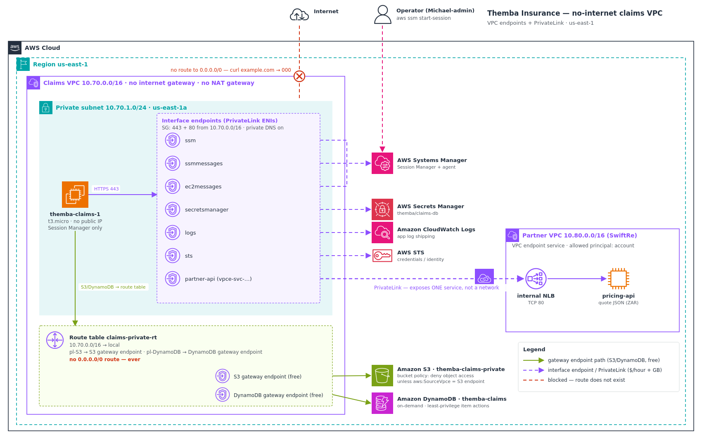

# No-Internet Private Connectivity: VPC endpoints + PrivateLink

Themba Insurance's regulator ruled that the servers processing policyholder claims must have **no route to the internet at all**. No internet gateway, no NAT gateway, nothing. Those same servers still need S3, DynamoDB, Systems Manager, Secrets Manager, CloudWatch Logs, STS, and an external partner's pricing API.

I built a claims VPC that physically cannot reach the internet, then gave it a private door to each service it needs: free **gateway endpoints** for S3 and DynamoDB, **interface endpoints (PrivateLink)** for everything else, and a **PrivateLink endpoint service** so the partner can expose exactly one API into Themba's network without joining the two networks together.

**Headline results:**

- `curl https://example.com` from the claims server returns **`000`**: there is no route, so the request never leaves the VPC.
- On the same box, over private endpoints, **S3 reads and writes work, DynamoDB reads and writes work, a Secrets Manager secret is retrieved, and the partner API returns a live quote.**
- Claims data is pinned to the private path. The S3 bucket rejects my own admin credentials with **`403 Forbidden`** when the request doesn't arrive through this VPC's endpoint.
- I broke Session Manager on purpose by removing one endpoint, diagnosed why an instance can show `Online` and still refuse sessions, and restored it.
- Everything was torn down to **`$0.00`** the same day.



---

## The problem I was solving

In [`aws-secure-vpc-network-firewall`](../../aws-secure-vpc-network-firewall) I controlled Themba's egress. Traffic could still leave, but it was inspected and filtered. For the claims-processing tier the regulator went further: the answer to "what can reach the internet?" has to be **nothing**. Not filtered. Absent.

> The claims servers must have no route to the internet (no IGW, no NAT), yet still reach S3, DynamoDB, SSM, Secrets Manager, CloudWatch Logs, STS, and a partner pricing API. Prove that a general internet call fails and that every required service still works over the AWS private network.

The obvious answers don't hold up:

- **A private subnet behind a NAT gateway.** A NAT gateway *is* a route to the internet. It only allows outbound connections, but the rule is "no route at all". It's also an always-on biller.
- **Allow-listing AWS IP ranges in a firewall.** AWS service IPs change constantly, the traffic still crosses the public internet, and the list is fragile to maintain.
- **Peering to a shared-services VPC that has NAT.** This just moves the internet route one hop away. Claims traffic still reaches the internet through it.

VPC endpoints are the answer that satisfies the rule by design. The claims VPC has no internet route, so nothing can misuse one. Each service it needs gets its own private entry point, and that traffic never leaves Amazon's network.

---

## Three ideas the whole build depends on

1. **"No internet" is a routing fact, not a firewall setting.** The route table holds only `local` plus the managed prefix-list routes for the two gateway endpoints. There is no `0.0.0.0/0` route. If an endpoint is missing, that service is simply unreachable.
2. **There are two kinds of endpoint, and they aren't interchangeable.**
   - **Gateway endpoints** exist only for S3 and DynamoDB. They're free and work by adding a route to the route table.
   - **Interface endpoints** (PrivateLink) cover almost everything else. Each one is an ENI with a private IP in your subnet, billed per hour and per GB, and relies on **private DNS** so the normal service hostname resolves to that private IP. Inside the VPC, `secretsmanager.us-east-1.amazonaws.com` resolved to `10.70.1.33`.
3. **Session Manager needs three endpoints: `ssm`, `ssmmessages` and `ec2messages`.** `ssm` and `ec2messages` keep the instance registered and `Online`. `ssmmessages` carries the actual session. With it missing, the console still shows `Online` but no session will open, which is why this is the classic trap.

---

## Architecture decisions

| Requirement | Decision | Why |
|---|---|---|
| No internet route at all | **Private-only VPC** with no IGW and no NAT | The absence of `0.0.0.0/0` is the enforceable form of the regulator's rule |
| Reach S3 and DynamoDB privately | **Gateway endpoints** | The only two gateway-endpoint services. Free, and just a route-table entry |
| Reach SSM, Secrets Manager, Logs and STS privately | **Interface endpoints** (PrivateLink), private DNS on | The only way to reach these services with no internet route |
| Administer servers with no internet | **SSM Session Manager** through `ssm`, `ssmmessages` and `ec2messages` | No bastion, no SSH, no public IP, no inbound rules |
| Claims bucket reachable only from this VPC | **Bucket policy** denying object access unless `aws:SourceVpce` matches | Pins the data to the private path. A leaked key used from anywhere else is refused |
| Least-privilege workload access | **Scoped instance role**: one bucket, one table, one secret | The endpoints provide the network path, and IAM still decides what's allowed |
| Consume a partner's private API | **PrivateLink endpoint service** (internal NLB) plus a consumer interface endpoint | Exposes one service, not a network. No CIDR routing between the VPCs |
| Prove it | Internet call fails, every service works, outside S3 access is denied, partner API is reached privately | Measured evidence rather than assurances |

Long-form reasoning is in [`docs/adr/`](docs/adr). The architecture diagram uses the **official AWS Architecture Icons** and is generated from [`docs/diagram/build_architecture.py`](docs/diagram/build_architecture.py), so it can be rebuilt instead of hand-edited. The icon pack itself isn't committed: AWS licenses it for diagrams, not redistribution. Point `AWS_ICONS_DIR` at your own download to regenerate.

---

## What I proved

| Test | Result | Evidence |
|---|---|---|
| General internet from the claims server | ✅ `000`, no route | [`08`](docs/screenshots/08-step7-no-internet-service-reached.png) |
| S3 and DynamoDB reached over gateway endpoints | ✅ Requests reach the services (see note below); scoped claim write and read-back succeed | [`08`](docs/screenshots/08-step7-no-internet-service-reached.png), [`09`](docs/screenshots/09-step7-claim-s3-dynamodb-readwrite.png) |
| Claims bucket from **outside** the endpoint (admin CLI) | ✅ `403 Forbidden` | [`10`](docs/screenshots/10-step8-sourcevpce-admin-denied.png) |
| Claims bucket from **inside** via the endpoint | ✅ Claim returned | [`11`](docs/screenshots/11-step8-sourcevpce-invpc-allowed.png) |
| Secrets Manager over PrivateLink | ✅ Secret retrieved; hostname resolves to `10.70.1.33` | [`12`](docs/screenshots/12-step9-secret-private-dns.png) |
| Partner API over PrivateLink | ✅ `{"partner":"SwiftRe",...,"currency":"ZAR"}` | [`15`](docs/screenshots/15-step11-partner-quote-over-privatelink.png) |
| Session Manager with `ssmmessages` removed | ✅ Broken while still `Online`, then restored | [`16`–`20`](docs/debugging-journey.md#4--the-trap-drill-online-is-not-the-same-as-reachable) |
| Teardown | ✅ Endpoints and VPCs gone, **`-US$0.00`** | [`21`](docs/screenshots/21-step14-endpoints-and-vpcs-gone.png), [`22`](docs/screenshots/22-step14-cost-explorer-zero.png) |

One subtlety in the evidence is worth spelling out. A bare `aws s3 ls` from the claims server returned `AccessDenied` for `s3:ListAllMyBuckets`, and that is a success signal for the network. **A timeout means there is no path. An API error means the request reached the service and the service answered.** The role deliberately has no account-wide list permissions, so IAM refused. That's least privilege still working on top of the private path.

Full walkthroughs are in [`docs/connectivity-proof.md`](docs/connectivity-proof.md) and [`docs/privatelink-partner-api.md`](docs/privatelink-partner-api.md).

---

## The mistake that taught me the most

My first version of the bucket lock denied **`s3:*`** unless the request came through the S3 endpoint. It worked perfectly for the proof. Then at teardown I deleted the endpoints first, so `aws:SourceVpce` could never match again. The deny then applied to **everyone**, including my own admin user, for every action on the bucket, including deleting the bucket policy itself. Only the account root user can recover from that.

The version in this repo denies only object actions (`GetObject`, `PutObject`, `DeleteObject`, `ListBucket`), so the data lock is identical but bucket management stays reachable. Teardown also removes the bucket policy before anything else touches the bucket. Full story: [`docs/debugging-journey.md`](docs/debugging-journey.md#2--the-awssourcevpce-lock-that-locked-me-out).

---

## Cost

| | This design | NAT-based alternative |
|---|---|---|
| NAT gateway (hourly) | **$0**, none | ~$32.85/mo |
| NAT data processing | **$0** | $0.045/GB on all S3, DynamoDB and API traffic |
| Gateway endpoints (S3, DynamoDB) | **$0** | n/a |
| Interface endpoints (7, one AZ) | ~$51/mo + $0.01/GB | n/a |
| Internet exposure | **None** | Outbound path exists |

This design is **compliance-first rather than a cost play**, and I want to be clear about that. Seven interface endpoints running around the clock cost more than one NAT gateway. But a NAT gateway can't satisfy a no-internet rule at any price. The free gateway endpoints also remove NAT data-processing charges on the highest-volume traffic (S3 and DynamoDB). The real cost lever is creating interface endpoints only for services the workload actually calls. Details are in [`docs/cost-model.md`](docs/cost-model.md). Rates are illustrative us-east-1 list prices at build time.

---

## Compliance & frameworks

Removing the internet path and gating every service call through a private, policy-controlled entry point maps directly onto the controls these frameworks require:

- **NIST SP 800-53 Rev. 5**
  - **SC-7 Boundary Protection** and **SC-7(5) Deny by Default / Allow by Exception**: no default route, and each allowed service is an explicit endpoint.
  - **AC-4 Information Flow Enforcement**: the bucket accepts object traffic only via `aws:SourceVpce`.
  - **AC-6 Least Privilege**: the role is scoped to one bucket, one table and one secret.
  - **SC-8 Transmission Confidentiality**: all service calls are TLS to private endpoints.
- **NIST Cybersecurity Framework 2.0**
  - **PR.IR-01**: networks protected from unauthorized logical access.
  - **PR.AA-05**: least-privilege access permissions.
  - **PR.DS-02**: data in transit protected.
- **ISO/IEC 27001:2022 Annex A**
  - **A.8.20 Networks security**
  - **A.8.21 Security of network services**: private endpoints and a scoped partner service.
  - **A.8.22 Segregation of networks**: PrivateLink exposes a service, not a routed network.
  - **A.5.23 Information security for use of cloud services**
- **PCI DSS v4.0 Requirement 1.3 / 1.4**, where premium card payments are in scope: outbound traffic is restricted to what's necessary, and connections between trusted and untrusted networks are controlled.
- **South Africa: FSCA / Prudential Authority Joint Standard 2 of 2024 (Cybersecurity and Cyber Resilience)**: the insurer-specific driver behind this regulator ruling. It requires a secure network architecture and controls on connectivity to third parties such as the pricing partner.
- **POPIA §19**: appropriate technical measures to secure policyholders' personal information.
- **HIPAA Security Rule §164.312(a)(1) and (e)(1)**, where claims carry medical information: access control and transmission security.

---

## Repo layout

```
.
├── README.md
├── ec2-trust.json          # instance role trust (EC2)
├── claims-data.json        # least-privilege S3 bucket + DynamoDB table access
├── secret-read.json        # read ONE secret only
├── bucket-vpce-lock.json   # the aws:SourceVpce data lock, scoped to object actions (teardown-safe)
├── api-userdata.sh         # partner pricing-API stub (systemd service)
└── docs/
    ├── architecture.png / architecture.svg   # architecture diagram (official AWS Architecture Icons)
    ├── diagram/                              # build_architecture.py + awsdiag.py helper (regenerates the diagram)
    ├── connectivity-proof.md     # no internet, every service works, SourceVpce lock, private DNS
    ├── privatelink-partner-api.md# producer (NLB + endpoint service) and consumer sides
    ├── debugging-journey.md      # the four real snags, including the self-lockout and the trap drill
    ├── cost-model.md             # endpoints vs NAT, honestly
    ├── teardown.md               # dependency-ordered teardown to $0
    ├── adr/                      # 4 architecture decision records
    └── screenshots/              # 22 build, proof, trap and teardown screenshots, in order
```

> **Placeholders:** the committed JSON uses `ACCOUNT_ID` and `S3_GATEWAY_ENDPOINT_ID` instead of real values. Substitute your own before applying.

---

## Reproduce it

Everything runs from the CLI in `us-east-1`:

1. Private-only VPC with DNS support and hostnames on, one private subnet, and a route table with **no** `0.0.0.0/0`.
2. Security groups: the endpoint SG allows 443 (and 80 for the partner API) from the VPC. The instance SG has no inbound rules.
3. Gateway endpoints for S3 and DynamoDB, attached to the route table.
4. Claims instance with no public IP, AL2023, and an instance profile with `AmazonSSMManagedInstanceCore`.
5. Interface endpoints `ssm`, `ssmmessages` and `ec2messages`, private DNS on. The instance goes `Online` and Session Manager connects.
6. Interface endpoints `secretsmanager`, `logs` and `sts`.
7. Proof: internet `000`; S3 and DynamoDB reached; claim written and read with `claims-data.json`.
8. `bucket-vpce-lock.json`: admin CLI gets `403`, in-VPC read succeeds.
9. Secret retrieved with `secret-read.json`; `nslookup` shows a `10.70.x.x` address.
10. Partner VPC: pricing API behind an internal NLB, published as an endpoint service with an allowed principal.
11. Consumer interface endpoint to the partner service; `curl` returns the quote.
12. Trap drill: delete `ssmmessages`, diagnose, restore.
13. Teardown: [`docs/teardown.md`](docs/teardown.md). **Delete the bucket policy before touching the bucket.**

---

## What this connects to

- [`aws-secure-vpc-network-firewall`](../../aws-secure-vpc-network-firewall): there, egress was filtered and inspected. Here the requirement goes further and removes the egress route entirely.
- [`aws-well-architected-remediation`](../../aws-well-architected-remediation): that project replaced SSH with Session Manager. This one shows what Session Manager needs when the instance has no internet at all.
- [`aws-transit-gateway-hub-spoke`](../../aws-transit-gateway-hub-spoke): same approach of modelling multi-account with single-account VPCs. Here the partner is a second VPC, and the production path uses the partner's account ARN as the allowed principal.
- [`aws-multi-region-dr-failover`](../../aws-multi-region-dr-failover) and [`aws-backup-archival-tested-restore`](../../aws-backup-archival-tested-restore): the same Themba Insurance claims platform, now isolated at the network layer.
- [`aws-kms-encryption-architecture`](../../aws-kms-encryption-architecture): the natural next layer, SSE-KMS on the claims bucket via a KMS interface endpoint, so reaching an object and decrypting it are separately controlled.
