# Connectivity proof: no internet, and every required service still works

The regulator's rule has two halves, and each needs its own evidence:

1. The claims server **cannot** reach the internet.
2. It **can** still reach every AWS service it depends on.

The first is proved by a request that dies for lack of a route. The second is proved by real reads and writes over private endpoints.

---

## 1. A VPC with no way out

I created `themba-claims-vpc` (10.70.0.0/16) with DNS support and DNS hostnames turned on. Both are required, or interface-endpoint private DNS won't resolve. I added one private subnet (10.70.1.0/24) and a dedicated route table. I never created an internet gateway or a NAT gateway.

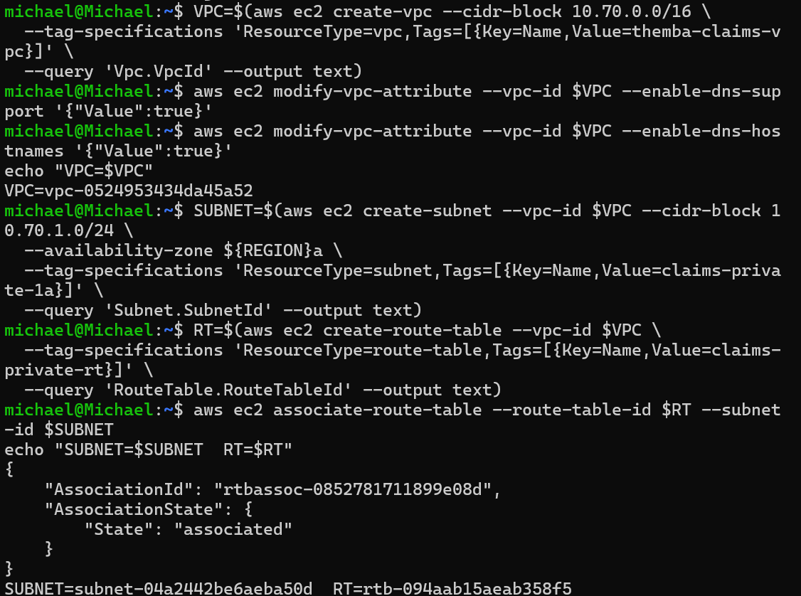

The route table has exactly one route: `10.70.0.0/16 → local`. That absence is the control.

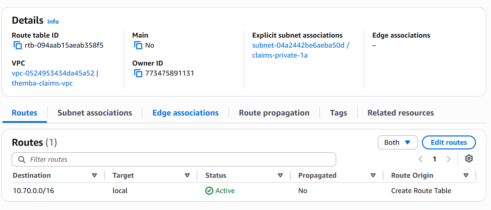

## 2. Security groups

- The **endpoint SG** allows TCP 443 from 10.70.0.0/16. Every AWS API call is HTTPS to an endpoint ENI, and without this rule each call hangs at the SG, which looks exactly like a missing endpoint. Port 80 was added later for the partner API.
- The **instance SG** has no inbound rules at all. Session Manager is an outbound connection from the agent, so no SSH and no bastion are needed.

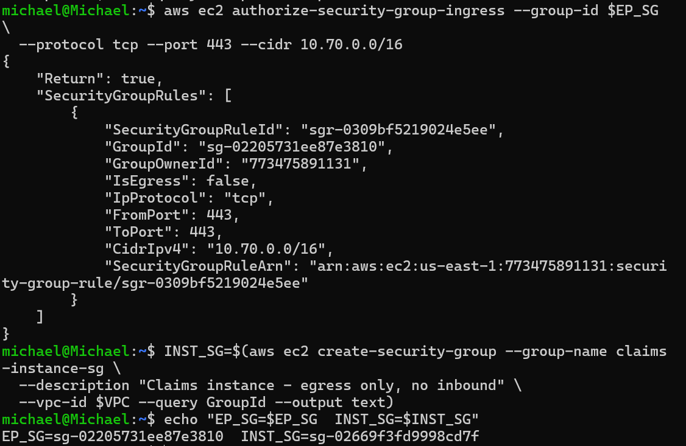

## 3. Gateway endpoints: S3 and DynamoDB, free

S3 and DynamoDB are the only services with gateway endpoints. They attach to a **route table**, not a subnet, and inject a managed prefix-list route. After creating them, the route table has `pl-63a5400a` (S3) and `pl-02cd2c6b` (DynamoDB) pointing at the endpoints, and still no `0.0.0.0/0`.

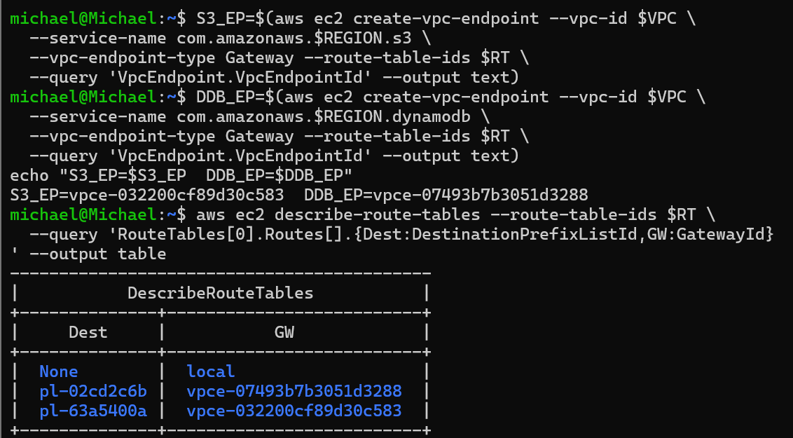

## 4. The claims server

The server is an AL2023 `t3.micro` in the private subnet, with **no public IPv4 address**, IMDSv2 required, and the `themba-claims-role` instance profile (`AmazonSSMManagedInstanceCore`). At this point it's running but unreachable, because Session Manager needs endpoints that don't exist yet.

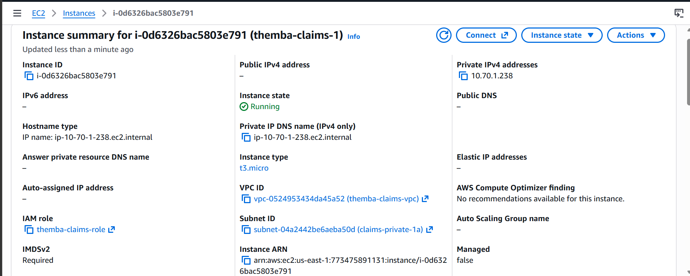

## 5. Session Manager over PrivateLink

I created the three interface endpoints Session Manager needs (`ssm`, `ssmmessages`, `ec2messages`) with `--private-dns-enabled`. Once they were `available`, the agent registered as **`Online`** and `aws ssm start-session` opened a shell on a server with no internet and no public IP.

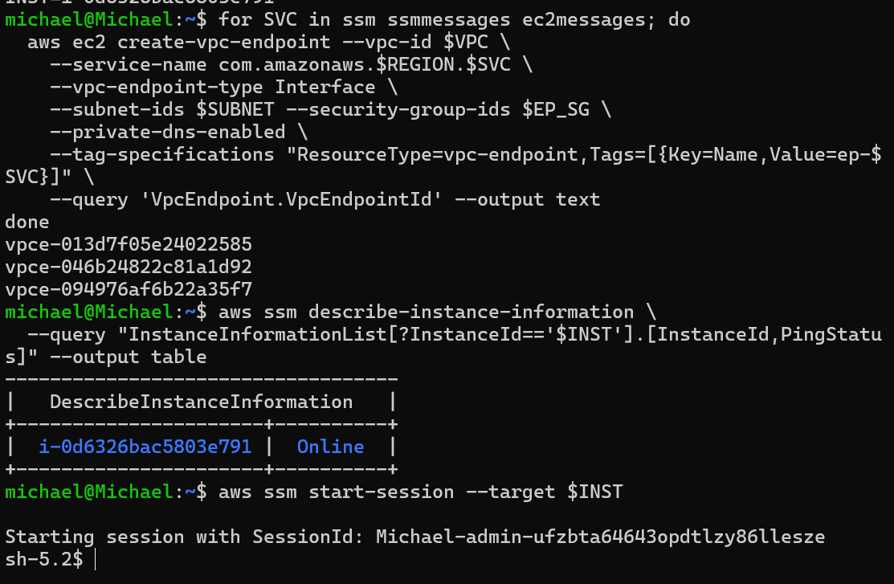

Next came `secretsmanager`, `logs` and `sts`. That's eight endpoints in total at this stage: two gateway and six interface.

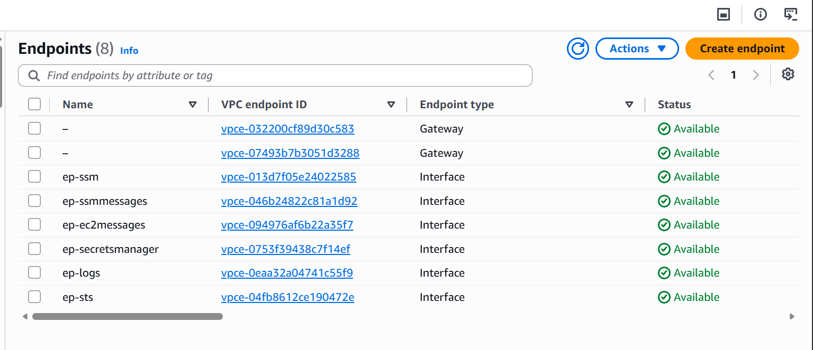

## 6. The core proof: no internet, but the services are reached

From inside the session:

```bash
curl -m 8 -s -o /dev/null -w "internet: %{http_code}\n" https://example.com   # -> 000
aws s3 ls                               # -> AccessDenied (s3:ListAllMyBuckets)
aws dynamodb list-tables                # -> AccessDenied (dynamodb:ListTables)
```

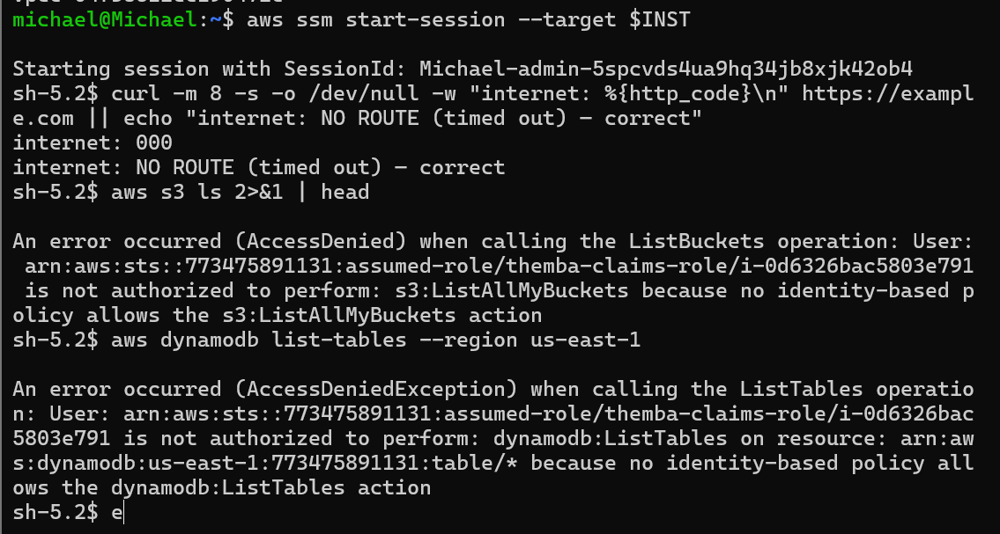

These three results mean different things:

- **`000`** is a timeout. There's no route, and the request never left the VPC.
- **`AccessDenied`** means the request **travelled the gateway endpoint, reached S3 or DynamoDB, and got an answer**. The answer is "IAM says no", because the role deliberately has no account-wide list permissions.

A timeout points to the network. An API error points to IAM. They're completely different failures, and telling them apart is the whole skill.

Then comes the scoped proof, using the actions `claims-data.json` does allow:

```bash
aws s3 cp /tmp/claim88123.txt s3://themba-claims-private-<ACCOUNT_ID>/claim88123.txt
aws s3 cp s3://themba-claims-private-<ACCOUNT_ID>/claim88123.txt -
aws dynamodb put-item --table-name themba-claims --item '{"claimId":{"S":"88123"},...}'
aws dynamodb get-item --table-name themba-claims --key '{"claimId":{"S":"88123"}}'
```

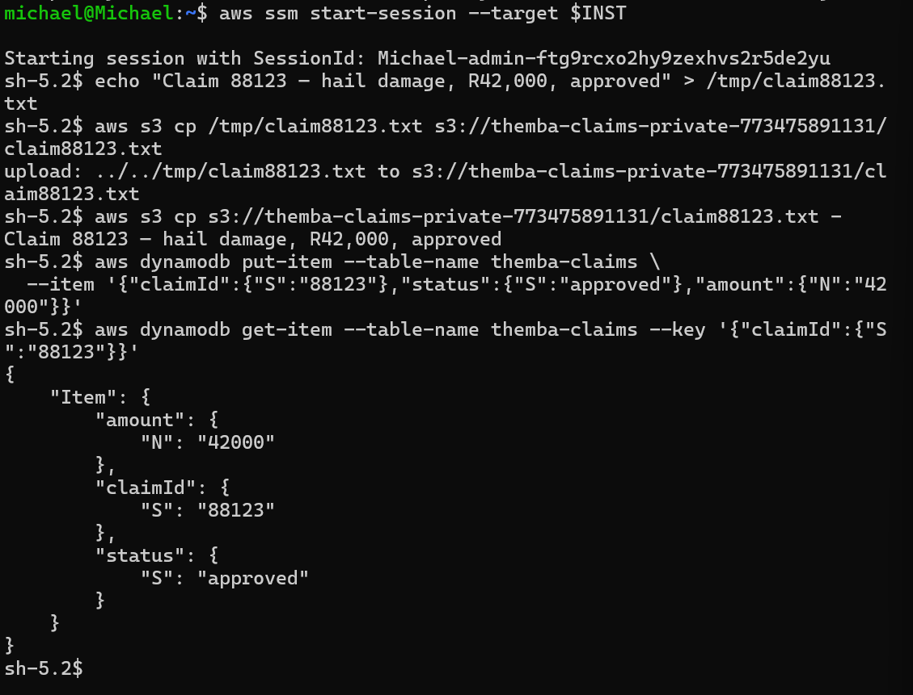

That's a full read and write on both S3 and DynamoDB from a server with no internet.

## 7. Pinning the data to the private path with `aws:SourceVpce`

With no internet, the **server** is protected. The bucket policy in [`../bucket-vpce-lock.json`](../bucket-vpce-lock.json) protects the **data**: it denies object access unless the request arrived through this VPC's S3 gateway endpoint.

From my admin terminal, which reaches S3 over the public path, the result is **`403 Forbidden`**, even with full admin credentials:

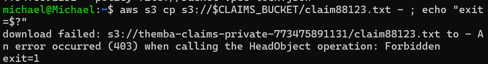

From inside the VPC, through the endpoint, the claim comes back:

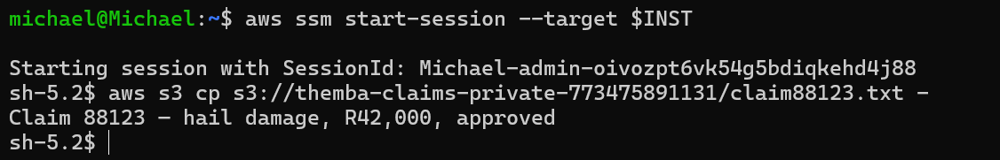

`aws:SourceVpce` is keyed on the endpoint ID. That makes it tighter than `aws:SourceIp`: it can't be spoofed and needs no IP-range maintenance. The policy denies **object actions only**. The first version denied `s3:*` and locked me out at teardown. See [`debugging-journey.md`](debugging-journey.md#2--the-awssourcevpce-lock-that-locked-me-out).

## 8. Secrets over PrivateLink, and proving private DNS

I stored `themba/claims-db` in Secrets Manager and granted the role `GetSecretValue` on that one secret ([`../secret-read.json`](../secret-read.json)). From the session, the secret came back. `nslookup secretsmanager.us-east-1.amazonaws.com` resolved to **`10.70.1.33`**, which is the interface endpoint's ENI, not a public IP.

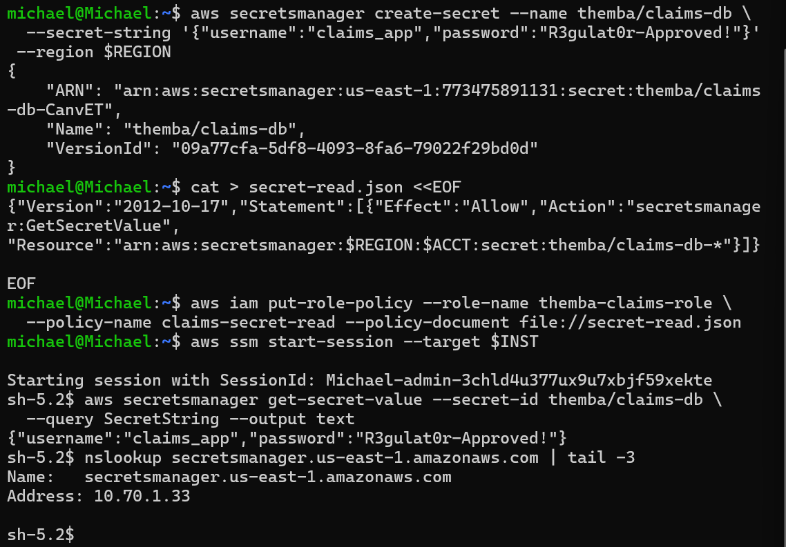

That's private DNS at work. The instance used the standard service hostname with no configuration change, and the VPC resolved it onto the private path.
