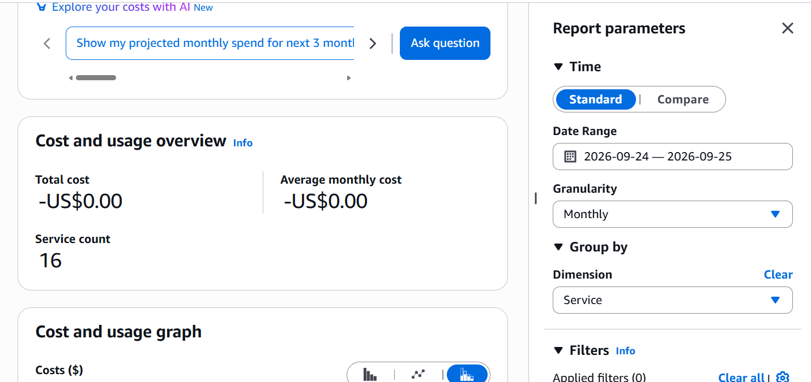

# Cost model: endpoints vs NAT

The regulator's rule is compliance-driven, so this design isn't primarily about saving money. There is still a real cost story, and it's easy to overstate, so here it is plainly.

Illustrative us-east-1 list rates at build time (check current pricing before you rely on these):

| Item | Rate |
|---|---|
| NAT gateway | $0.045/hour + $0.045/GB processed |
| Interface endpoint | ~$0.01 per endpoint per AZ per hour + $0.01/GB processed |
| Gateway endpoint (S3, DynamoDB) | **free** |

## Monthly, one AZ, running 24/7 (730 hours)

| | This design | NAT-based alternative |
|---|---|---|
| NAT gateway hours | $0 | $32.85 |
| Interface endpoints (7 × $0.01 × 730) | $51.10 | $0 |
| Gateway endpoints | $0 | $0 |
| **Fixed monthly total** | **~$51** | **~$33** |
| Per GB to S3 / DynamoDB | **$0** (gateway endpoints) | $0.045 |
| Per GB to other AWS APIs | $0.01 | $0.045 |
| Internet route | **None** | Exists (outbound) |

## How to read this

- **At low traffic, endpoints cost more than NAT.** Seven interface endpoints running around the clock cost more than one NAT gateway, and I'd rather state that than bury it.
- **NAT isn't an option anyway.** A NAT gateway is a route to the internet, so it fails the regulator's rule at any price.
- **At volume, the gap closes.** Claims processing is S3- and DynamoDB-heavy, and that traffic is **free** over gateway endpoints but costs $0.045/GB through NAT. Interface-endpoint data processing is also cheaper per GB than NAT processing.
- **The biggest lever is endpoint count.** Only create interface endpoints for services the workload actually calls, and share them deliberately across subnets. For multi-account estates, centralising interface endpoints in a shared-services VPC is the next step (see [`aws-transit-gateway-hub-spoke`](../../../aws-transit-gateway-hub-spoke)).
- **For resilience, add endpoints per AZ.** Interface endpoints are AZ-specific. This lab ran single-AZ, and production would double the endpoint-hours to span two AZs.

## What the build actually cost

Built and torn down within a morning. Cost Explorer for the window showed **`-US$0.00`** across 16 services.

