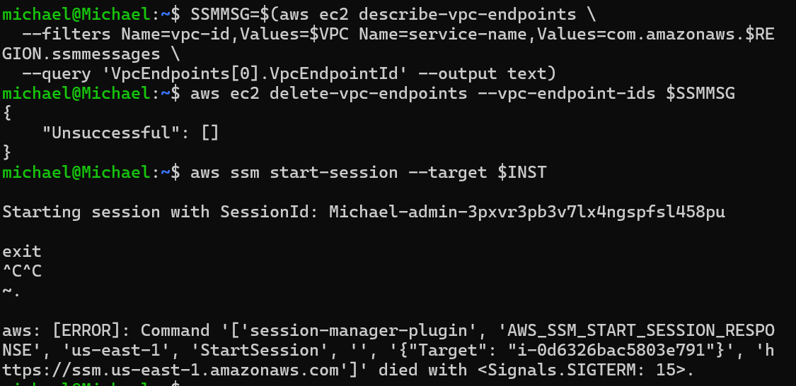
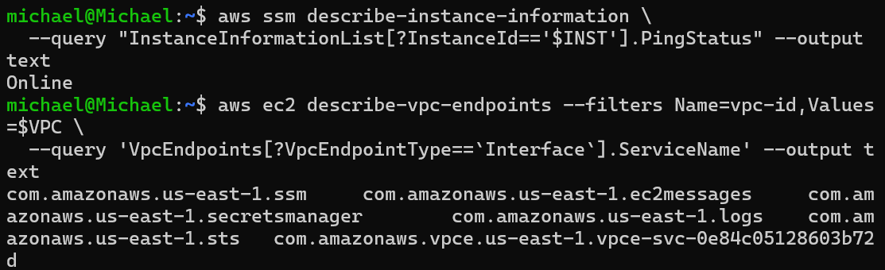
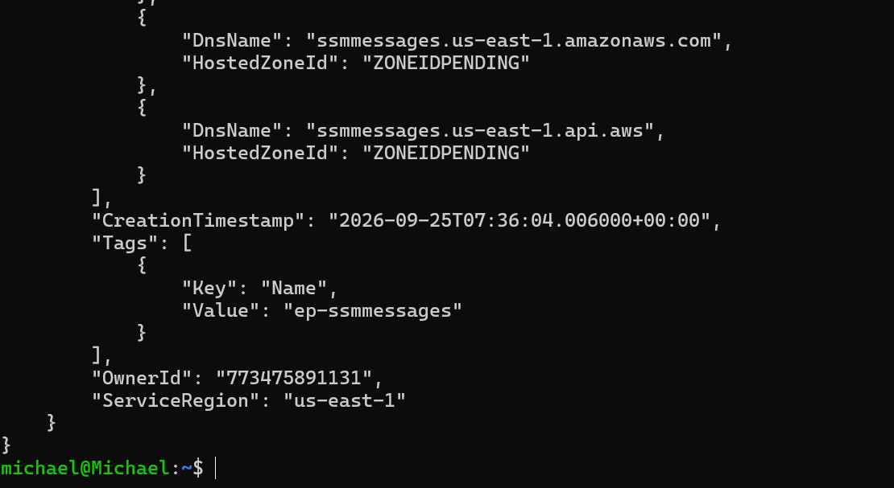
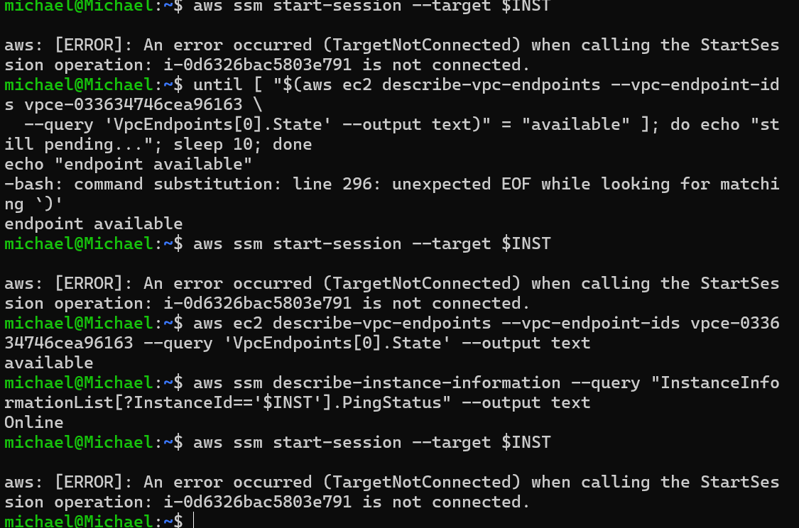
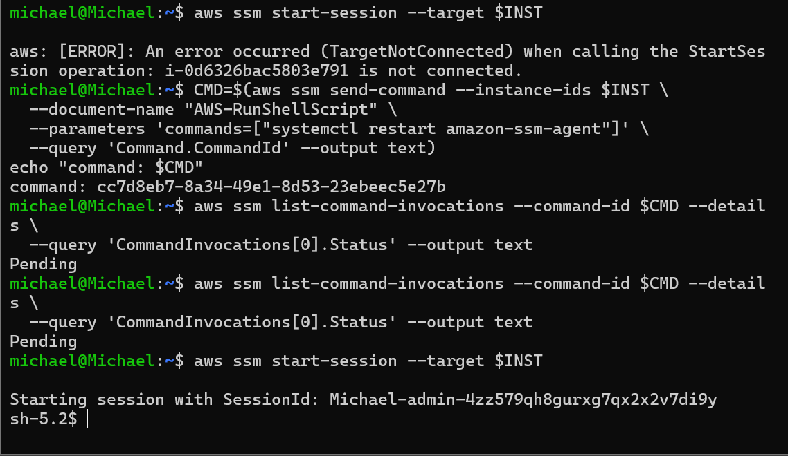

# Debugging journey

These are the real snags from building this end to end. None of them was a broken service. They're kept here on purpose, because on a network with no internet every failure looks like "it hangs", and the skill is working out *which* layer is refusing you.

---

## 1 — `AccessDenied` from a box with no internet is good news

**Where:** the first service check from inside the claims server.

**What I saw:** `curl https://example.com` returned `000`. Correct. But `aws s3 ls` and `aws dynamodb list-tables` both returned `AccessDenied`, and my first instinct was that the endpoints weren't working.


**What it actually meant:** the endpoints were working perfectly. There are two failure types here, and they look nothing alike once you know to separate them:

| Symptom | Meaning | Layer |
|---|---|---|
| Hang, then timeout (`000`) | No path to the destination | Network |
| Immediate API error (`AccessDenied`) | The request **reached the service** and it answered | IAM |

The instance role only had `claims-data.json`: get and put on one bucket, item actions on one table. Bare `aws s3 ls` needs `s3:ListAllMyBuckets`, and `list-tables` needs `dynamodb:ListTables`. Both are account-wide actions I deliberately never granted.

**Fix:** none needed. I proved the path with the actions the role *does* allow: scoped `s3 cp` and DynamoDB `put-item`/`get-item`, which all succeeded.

**Lesson:** on a private network, read the failure before you touch the network. A timeout is a routing problem. An API error means the routing worked.

---

## 2 — The `aws:SourceVpce` lock that locked me out

**Where:** teardown.

**What I did:** my first version of the bucket lock denied **`s3:*`** to `Principal: "*"` unless `aws:SourceVpce` matched the S3 gateway endpoint. During the proof it behaved perfectly: admin got `403`, and the in-VPC read worked.

**What broke:** teardown deletes the VPC endpoints first. Once the S3 endpoint was gone, **no request could ever satisfy the condition again**, so the deny applied to everyone for every S3 action on that bucket. My admin user got:

```
AccessDenied ... s3:ListBucket  ... with an explicit deny in a resource-based policy
AccessDenied ... s3:DeleteBucket ... with an explicit deny in a resource-based policy
```

IAM permissions can't override an explicit deny in a resource policy. Even signed in as the **root user**, most of the bucket's console panels failed. For example, *Block public access* returned `AccessDenied` on `s3:GetBucketPublicAccessBlock`.

**Recovery:** the bucket-owning account's **root user** can still get, put and delete the bucket policy even when that policy denies everyone else. That's the documented escape hatch. Signed in as root, I deleted the bucket policy from the *Bucket policy* panel (or `aws s3api delete-bucket-policy` from CloudShell), then emptied and deleted the bucket as my normal admin user.

**The fix in this repo:**

1. [`../bucket-vpce-lock.json`](../bucket-vpce-lock.json) denies only **object actions** (`GetObject`, `PutObject`, `DeleteObject`, `ListBucket`). The data lock is identical, but bucket management (`PutBucketPolicy`, `DeleteBucketPolicy`, `DeleteBucket`) stays reachable for the owner.
2. Teardown runs `delete-bucket-policy` **before** emptying the bucket, because a scoped deny still blocks admin-side `DeleteObject` from outside the endpoint.

**Lesson:** any deny policy conditioned on something that can disappear (an endpoint, a VPC, an IP range, a principal) has to be checked against the question *"can I still manage and delete this resource once that thing is gone?"* If the answer is no, scope the deny to data-plane actions and remove the policy first when you tear down.

---

## 3 — There's no waiter for VPC endpoints

**Where:** waiting for the consumer endpoint to the partner service.

**What I saw:**
```
aws ec2 wait vpc-endpoint-available ...
Found invalid choice 'vpc-endpoint-available'
```

**Cause:** the AWS CLI has waiters for many EC2 resources (`instance-running`, `nat-gateway-available`, …), but **not for VPC endpoints**.

**Fix:** poll the state directly:
```bash
until [ "$(aws ec2 describe-vpc-endpoints --vpc-endpoint-ids $PL_EP \
  --query 'VpcEndpoints[0].State' --output text)" = "available" ]; do sleep 10; done
```

**Lesson:** don't assume a waiter exists. `aws ec2 wait help` lists the real ones.

---

## 4 — The trap drill: `Online` is not the same as reachable

**Where:** the deliberate break. I removed the `ssmmessages` endpoint to see what a partially-endpointed private instance looks like.

**a. The first attempt caught the deletion mid-flight.** Straight after `delete-vpc-endpoints`, `start-session` still opened a session, because the endpoint was still being torn down. When I typed `exit`, the session's data channel was gone and the session hung. Ctrl-C and `~.` did nothing, and the session-manager plugin had to be killed (`SIGTERM`).



**b. The misleading part.** With the endpoint fully gone, the instance still reported **`Online`**. Listing the interface endpoints showed the gap: `ssm`, `ec2messages`, `secretsmanager`, `logs`, `sts` and the partner service were all present, but **no `ssmmessages`**.



`ssm` and `ec2messages` keep the agent registered and `Online`. `ssmmessages` carries the interactive session. Losing it doesn't change the status the console shows you, and that's exactly why this catches people.

**c. Restore, and the recovery lag.** I recreated `ssmmessages`, and it came up `pending`:



Even after it reached `available` and the instance still showed `Online`, `start-session` returned **`TargetNotConnected`**. The agent hadn't re-established its session channel through the new endpoint yet.



**d. Reconnected.** I sent a Run Command to restart the SSM agent. It sat at `Pending` in both checks I captured, so I can't claim it's what fixed things. Shortly afterwards the session opened again: the agent re-established the channel on its own retry cycle.



**Lesson:** on a no-internet instance, *registered* (`ssm` + `ec2messages`) and *reachable by Session Manager* (`ssmmessages`) are separate states, served by separate endpoints. When Session Manager fails on a private box:

1. List the interface endpoints first.
2. Don't trust `Online` as proof that you can connect.
3. After any endpoint churn, give the agent a few minutes to rebuild its channels before assuming something is still broken.

---

## The pattern across all four

- One was reading the failure correctly: a timeout versus an API error.
- One was a policy that outlived the resource it depended on.
- One was a missing CLI convenience.
- One was a status field that doesn't mean what it appears to mean.

All four only surfaced because the build was actually run and torn down end to end.
