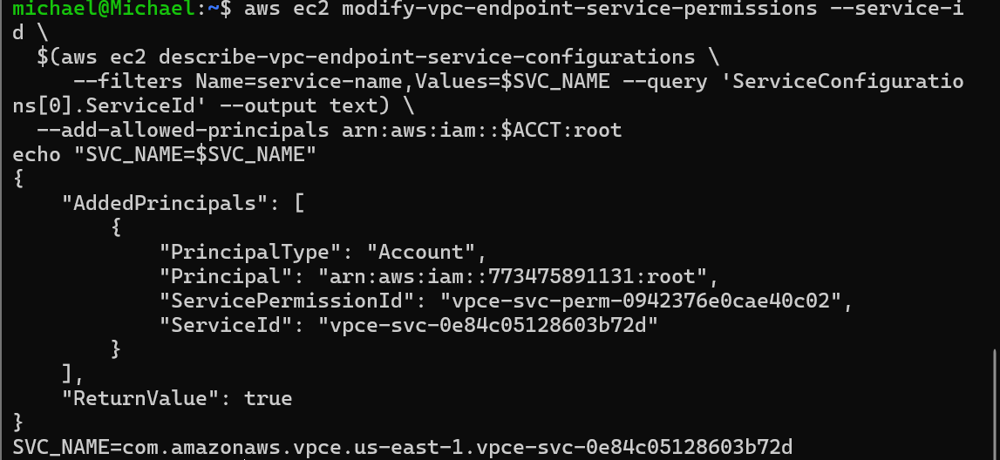
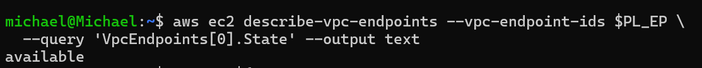
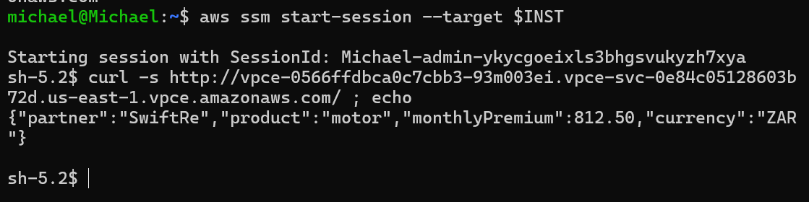

# PrivateLink partner API: one service, not a network

The claims app needs a quote from **SwiftRe**, a pricing partner. The no-internet rule applies to that call too. PrivateLink lets the partner publish **exactly one service** into Themba's VPC. Nothing gets routed between the two networks, their CIDR ranges never need to know about each other, and cross-account access is controlled by an allowed-principal list.

I built both sides. The partner is modelled as a second VPC in the same account, the same testability trade-off I used in `aws-transit-gateway-hub-spoke`. In production, the allowed principal is the consumer's account ARN.

## Producer side (the partner)

- **`partner-vpc` (10.80.0.0/16).** It's allowed internet access because it belongs to a different company. Only Themba's VPC must be internet-less.
- **`pricing-api` instance.** It serves a fixed quote JSON on port 80 from [`../api-userdata.sh`](../api-userdata.sh), run as a systemd service so it survives cloud-init and restarts if it dies.
- **Internal Network Load Balancer** on TCP 80, targeting the instance. PrivateLink endpoint services must sit on an **NLB or GWLB**, not an ALB.
- **VPC endpoint service** on the NLB, with `--no-acceptance-required` for the lab and the consumer account added as an **allowed principal**.



The service name has the form `com.amazonaws.vpce.us-east-1.vpce-svc-…`. That's what the consumer targets, in place of a `com.amazonaws.<region>.<service>` AWS name.

## Consumer side (Themba's claims VPC)

An interface endpoint in the claims subnet points at the partner's service name, using the same endpoint SG (with port 80 added from the VPC). There's no CLI waiter for VPC endpoints, so I polled `describe-vpc-endpoints` until the state read `available`:



From the claims server, which has no internet route:

```bash
curl -s http://vpce-…-93m003ei.vpce-svc-0e84c05128603b72d.us-east-1.vpce.amazonaws.com/
```



```json
{"partner":"SwiftRe","product":"motor","monthlyPremium":812.50,"currency":"ZAR"}
```

## Why PrivateLink rather than VPC peering

| | PrivateLink | VPC peering |
|---|---|---|
| What's exposed | **One service** (the NLB listener) | **The entire network** (every routable IP both ways) |
| Direction | Consumer → service only | Bidirectional |
| CIDR overlap | Irrelevant | Must not overlap |
| Blast radius if the partner is compromised | That one API | Anything reachable in the claims VPC |
| Cross-account control | Allowed-principal list on the service | Peering acceptance plus route tables plus SGs |

For a third party, the smallest possible exposure is the correct answer. See [ADR 0003](adr/0003-privatelink-over-peering-for-partner-api.md).
