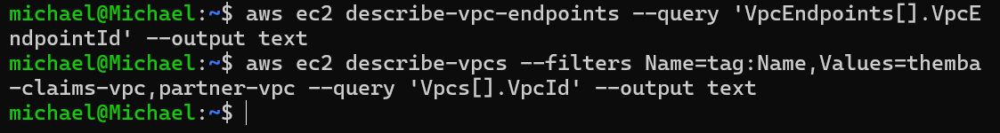

# Teardown

Interface endpoints and the NLB bill by the hour, so everything comes down the same day, in dependency order.

## Order of operations

```bash
# 1. Remove the claims-bucket lock FIRST, while nothing else has changed.
#    It denies DeleteObject from outside the endpoint, so emptying the bucket
#    from the admin CLI fails until the policy is gone. (The repo policy leaves
#    DeleteBucketPolicy un-denied, so this always works for the owner.)
aws s3api delete-bucket-policy --bucket $CLAIMS_BUCKET

# 2. All endpoints in the claims VPC (gateway, interface, PrivateLink consumer)
aws ec2 describe-vpc-endpoints --filters Name=vpc-id,Values=$VPC \
  --query 'VpcEndpoints[].VpcEndpointId' --output text | tr '\t' '\n' | \
  xargs -r aws ec2 delete-vpc-endpoints --vpc-endpoint-ids

# 3. Producer side: endpoint service, then listener → NLB → target group
SVC_ID=$(aws ec2 describe-vpc-endpoint-service-configurations \
  --filters Name=service-name,Values=$SVC_NAME --query 'ServiceConfigurations[0].ServiceId' --output text)
aws ec2 delete-vpc-endpoint-service-configurations --service-ids $SVC_ID
aws elbv2 delete-listener --listener-arn $LSN
aws elbv2 delete-load-balancer --load-balancer-arn $NLB
aws elbv2 delete-target-group --target-group-arn $TG

# 4. Instances
aws ec2 terminate-instances --instance-ids $INST $PAPI
aws ec2 wait instance-terminated --instance-ids $INST $PAPI

# 5. Data: bucket (policy already removed), table, secret
aws s3 rm s3://$CLAIMS_BUCKET --recursive
aws s3api delete-bucket --bucket $CLAIMS_BUCKET
aws dynamodb delete-table --table-name themba-claims --region $REGION
aws secretsmanager delete-secret --secret-id themba/claims-db --force-delete-without-recovery --region $REGION

# 6. IAM
aws iam remove-role-from-instance-profile --instance-profile-name themba-claims-profile --role-name themba-claims-role
aws iam delete-instance-profile --instance-profile-name themba-claims-profile
for p in claims-data-access claims-secret-read; do aws iam delete-role-policy --role-name themba-claims-role --policy-name $p; done
aws iam detach-role-policy --role-name themba-claims-role --policy-arn arn:aws:iam::aws:policy/AmazonSSMManagedInstanceCore
aws iam delete-role --role-name themba-claims-role

# 7. Networking (endpoints must be fully gone; retry after ~60s if "has dependencies")
aws ec2 delete-security-group --group-id $EP_SG
aws ec2 delete-security-group --group-id $INST_SG
aws ec2 delete-subnet --subnet-id $SUBNET
aws ec2 delete-route-table --route-table-id $RT
aws ec2 delete-vpc --vpc-id $VPC
aws ec2 delete-security-group --group-id $PSG
aws ec2 delete-subnet --subnet-id $PSUB
aws ec2 detach-internet-gateway --internet-gateway-id $PIGW --vpc-id $PVPC
aws ec2 delete-internet-gateway --internet-gateway-id $PIGW
aws ec2 delete-route-table --route-table-id $PRT
aws ec2 delete-vpc --vpc-id $PVPC
```

## Why this order

- **Bucket policy before endpoints.** This is the lesson from the build. My first policy denied `s3:*`, and deleting the endpoint first turned it into an all-principals lockout that needed the root user to undo. See [`debugging-journey.md`](debugging-journey.md#2--the-awssourcevpce-lock-that-locked-me-out).
- **Endpoint service before NLB, and NLB before target group.** Each one references the next.
- **Endpoints before the VPC.** A VPC won't delete while endpoints (or their ENIs) are still attached.
- **Interface endpoints stop billing the moment they're deleted.**

## Confirm clean

```bash
aws ec2 describe-vpc-endpoints --query 'VpcEndpoints[].VpcEndpointId' --output text                                     # empty
aws ec2 describe-vpcs --filters Name=tag:Name,Values=themba-claims-vpc,partner-vpc --query 'Vpcs[].VpcId' --output text  # empty
```



Cost Explorer for the build window showed **`-US$0.00`**:


